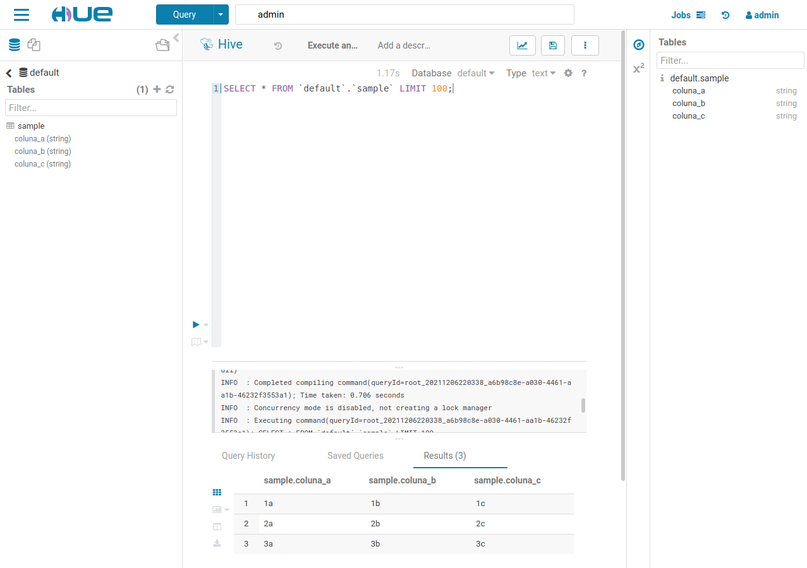

# Sparkify Airflow and Big Data test environment

## Table of Contents

- [About](#about)
- [Getting Started](#getting_started)
- [Usage](#usage)
- [Contributing](../CONTRIBUTING.md)

## About <a name = "about"></a>

This project contains the files needed to run tests on Sparkify Airflow Cluster and Big Data environment.

## Getting Started <a name = "getting_started"></a>
To use the environment test you just need to download this repository and run the `start.sh` script.

### Prerequisites

To run the environment test you need:
- Bash. which is native in mostly Unix-based systems, but you'll need an [workaround](https://itsfoss.com/install-bash-on-windows/#:~:text=Bash%20on%20Windows%20provides%20a,that%20you%20find%20on%20Linux.) in Windows systems (not tested).
- [Docker](https://www.docker.com/)
- [Docker Compose](https://docs.docker.com/compose/)

## Usage <a name = "usage"></a>
It's recommended to include this project as a submodule to your main project. To do this, initialize the local `git` repository in the desired folder:
```
cd /path/to/folder
git init
```
Then add the files from this repository to your local project repository and delete the `.github` folder inside the `sparkify-airflow` subdirectory.

The idea of the `sparkify-airflow` here is just **consume** it and never update it. So you may want to include whole module at a `.gitignore` file, except for some files. For example, you want to create a project and create versions of your dag, so you should add to your `.gitignore` the following lines:
```
sparkify-airflow/mnt/hue/*
sparkify-airflow/docker/
sparkify-airflow/mnt/airflow/*.cfg
sparkify-airflow/LICENSE
sparkify-airflow/*.sh
sparkify-airflow/*.yml
sparkify-airflow/.gitignore
```
Then you should be able to run the `sparkify-airflow/start.sh` script and use the big data environment.

## Available webservers
| Resource 	|         Address        	|  Login  	| Password 	|  Database  	|
|:--------:	|:----------------------:	|:-------:	|:--------:	|:----------:	|
|  Airflow 	|  http://localhost:8080 	| airflow 	|  airflow 	|      -     	|
|    Hue   	| http://localhost:32762 	|    -    	|     -    	|      -     	|
|  Adminer 	| http://postgres:5432 	| airflow 	|  airflow 	| airflow_db 	|

## Available Scripts
### `csv2hdp.sh`
`csv2hdp.sh` is a script to transfer `.csv` files from a staging area defined by `STAGING_CSV` environment variable and transfer it to Hive.

#### Environment Variables
| Env. Variable 	|             Value            	|                               Description                              	|
|:-------------:	|:----------------------------:	|:----------------------------------------------------------------------:	|
|    **`HIVE_HOME`**    	|       `/opt/hive`       	| Apache Hive home directory.                                      	|
|    **`CSV2HDP`**    	|       `/opt/csv2hdp/src`       	| Parent directory of `csv2hdp.sh`.                                       	|
|  **`STAGING_CSV`**  	|     `/opt/csv2hdp/staging`     	| Staging folder to put the `.csv` files to be transfer by `csv2hdp.sh`. 	|
|   **`HIVE_JDBC`**   	| `jdbc:hive2://localhost:10000` 	| JDBC connection string for Hive.                                       	|

#### Basic usage:
With `sample.csv` at `STAGING_CSV`, you should execute the following command in `hive-server`:
```
csv2hdp.sh --file sample.csv --database default
```
After that you should see the `sample` table at `default` database as seen below.


# Acknowledgement
- [marclamberti](https://github.com/marclamberti): idea and initial work
